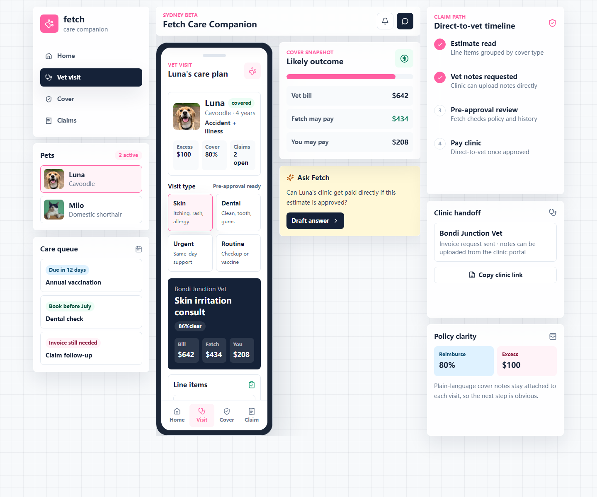

# Fetch Care Companion

A polished product concept for Fetch: a calmer way for pet parents to manage vet visits, understand cover, and start a direct-to-vet claim from one mobile-first flow.

This is an unofficial concept built for the Fetch application bonus prompt: "build something beautiful for Fetch."



## Product idea

Pet insurance gets stressful at the exact moment a pet parent is already worried. Fetch Care Companion turns a vet quote or invoice into a clear, warm next step:

- Choose the pet and visit type
- Add a vet estimate
- See likely covered items, review items, and not-covered items
- Estimate what Fetch may pay and what the pet parent may pay
- Track missing documents and direct-to-vet claim progress

## What is built

- Mobile-first product surface inspired by Fetch's "one pink app" positioning
- Interactive pet and visit-type selection
- Mock full-stack estimate parser using a Next.js API route
- Loading, empty, and error states
- Coverage summary, line-item review, care queue, policy clarity, and claim timeline
- Responsive desktop shell for walkthroughs and recruiter review

## Stack

- Next.js App Router
- React
- TypeScript
- Tailwind CSS
- Lucide React icons

## Run locally

```bash
npm install
npm run dev
```

Open `http://localhost:3000`.

## Walkthrough script

1. Start on Luna's vet visit.
2. Choose a visit type such as Skin, Dental, Urgent, or Routine.
3. Click "Read sample estimate".
4. Watch the estimate move through loading into plain-English cover guidance.
5. Review the claim timeline, likely out-of-pocket cost, missing documents, and clinic handoff.

## Why this fits Fetch

Fetch is looking for someone who can take a product idea from concept to design to code. This prototype focuses on the details that make consumer health and insurance feel less intimidating: clear language, fast feedback, stateful UI, direct next actions, and a product surface that feels caring without becoming childish.
